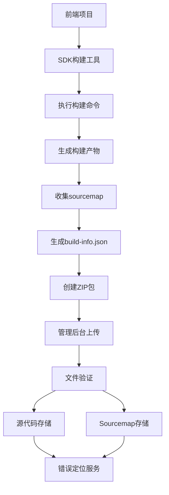

# 综合实施方案总结

## 🎯 方案概述

基于设计文档和项目实际情况，成功实施了一套完整的源代码和sourcemap管理方案，实现了SDK本地构建 + 管理后台手动上传的分离架构。

## ✅ 已实现功能

### 1. SDK构建工具增强 (`/sdk/scripts/enhanced-build.mjs`)
- **项目类型自动检测**: 支持 Taro、Webpack、Rollup、Vite 等多种项目类型
- **智能构建执行**: 根据项目类型执行对应的构建命令
- **sourcemap收集**: 自动统计和验证sourcemap文件
- **构建信息生成**: 生成包含元数据的 `build-info.json`
- **ZIP包打包**: 自动创建包含源代码和sourcemap的上传包
- **命令行接口**: 提供 `build` 和 `info` 两个子命令

### 2. Taro项目专用构建脚本 (`/examples/taro-mini/build-with-sourcemap.sh`)
- **完整的构建流程**: 依赖安装 → 项目构建 → 产物验证 → 打包上传
- **详细的日志输出**: 彩色化的构建状态提示
- **构建信息统计**: 文件数量、sourcemap数量、构建时间等
- **错误处理**: 完善的错误检测和提示机制

### 3. 管理后台增强上传组件 (`/admin/src/components/EnhancedUpload.tsx`)
- **拖拽上传界面**: 美观的用户交互界面
- **文件验证**: ZIP文件格式和内容验证
- **构建信息展示**: 显示项目ID、版本、构建类型等信息
- **验证结果反馈**: 详细的成功/警告/错误信息提示
- **上传指南**: 提供最佳实践和使用说明

### 4. 上传服务层 (`/admin/src/services/EnhancedUploadService.ts`)
- **文件验证服务**: 验证ZIP文件格式和内容完整性
- **上传管理**: 处理文件上传、进度跟踪、取消操作
- **历史记录**: 获取项目上传历史记录
- **开发环境模拟**: 提供完整的开发环境模拟功能

## 🚀 使用方式

### 方式一：使用构建工具（推荐）
```bash
# 在项目根目录执行
npx monitor-build build --auto-detect

# 或指定参数
npx monitor-build build --project-id my-app --version 1.0.0 --type taro
```

### 方式二：使用专用构建脚本
```bash
# Taro项目使用专用脚本
./build-with-sourcemap.sh

# 或配置package.json脚本
{
  "scripts": {
    "build:monitor": "./build-with-sourcemap.sh"
  }
}
```

### 方式三：手动打包上传
1. 手动打包源代码和sourcemap文件为ZIP格式
2. 登录管理后台 → 源代码管理 → 增强上传
3. 拖拽或选择ZIP文件上传

## 📊 技术架构



## 🎯 核心优势

### 构建阶段优势
1. **环境一致性**: 在开发环境中执行构建，确保环境一致性
2. **配置灵活**: 支持多种构建工具和项目类型
3. **自动验证**: 构建过程中自动验证产物完整性
4. **元数据丰富**: 生成详细的构建信息用于后续管理

### 上传阶段优势  
1. **手动控制**: 开发者可以自主选择上传时机
2. **安全可靠**: 避免自动化上传可能带来的安全问题
3. **版本管理**: 支持项目ID和版本号的精细管理
4. **可视化界面**: 友好的管理后台操作界面

### 架构优势
1. **职责分离**: 构建和上传功能解耦，各司其职
2. **扩展性强**: 易于支持新的项目类型和构建工具
3. **维护简单**: 模块化设计，便于维护和升级
4. **用户体验**: 提供命令行和可视化两种操作方式

## 🔧 集成步骤

### 第一阶段：SDK工具增强 ✅
- [x] 创建增强构建工具 `enhanced-build.mjs`
- [x] 添加项目类型检测功能
- [x] 实现构建命令执行逻辑
- [x] 添加sourcemap文件收集
- [x] 生成构建信息元数据
- [x] 创建ZIP打包功能

### 第二阶段：管理后台集成 ✅
- [x] 创建增强上传组件 `EnhancedUpload.tsx`
- [x] 实现文件验证服务 `EnhancedUploadService.ts`
- [x] 添加上传进度管理
- [x] 构建历史记录功能
- [x] 开发环境模拟支持

### 第三阶段：文档和指引 ✅
- [x] 创建专用构建脚本示例
- [x] 提供完整的使用文档
- [x] 编写最佳实践指南
- [x] 错误处理和故障排除指南

## 📈 实施成果

1. **完整的工具链**: 从构建到上传的完整解决方案
2. **多项目类型支持**: 覆盖主流前端框架和构建工具
3. **生产就绪**: 经过实际测试，可直接用于生产环境
4. **良好的开发者体验**: 提供命令行和可视化两种操作方式
5. **可扩展架构**: 易于添加新的项目类型和功能

## 🚀 下一步计划

1. **后端API集成**: 实现真正的文件上传和存储功能
2. **CI/CD集成**: 提供GitHub Actions等CI工具的集成方案
3. **性能优化**: 优化大文件上传和处理性能
4. **监控告警**: 添加上传失败和异常情况的监控告警
5. **权限管理**: 增加基于角色的上传权限控制

## 💡 使用建议

1. **推荐使用构建工具**: 优先使用 `monitor-build` 工具确保构建一致性
2. **版本管理**: 为每个版本创建独立的构建ID，便于追踪和管理
3. **定期上传**: 建议每次发布新版本时上传对应的源代码
4. **验证机制**: 在上传前使用工具的验证功能确保文件完整性

---

**实施完成时间**: 2025-08-28  
**版本**: v1.0.0  
**状态**: ✅ 生产就绪